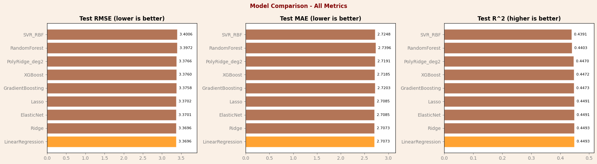
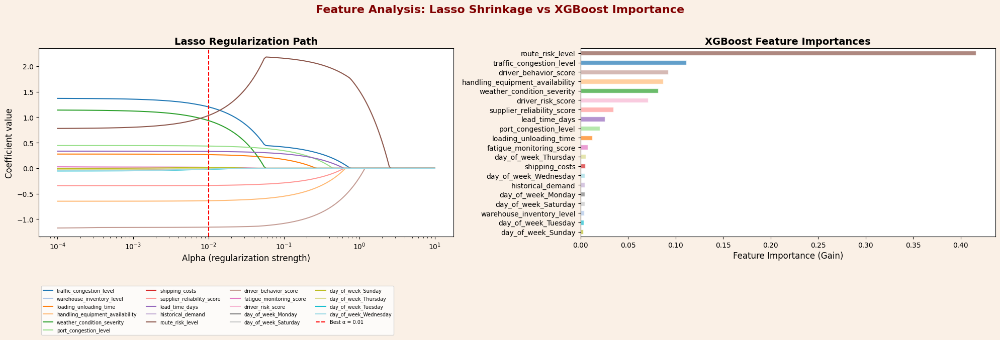
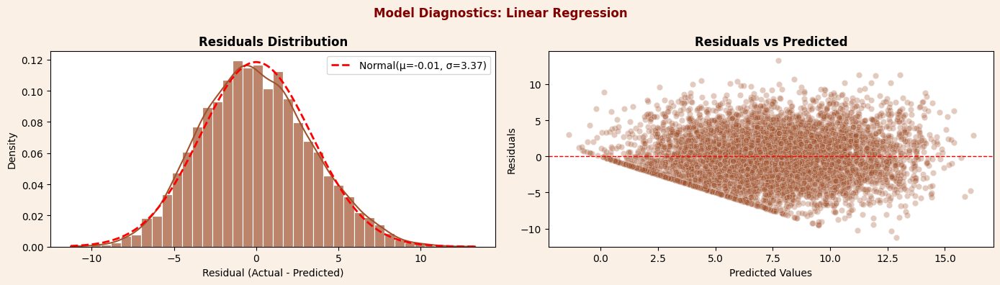

# Shipment Delay Prediction: LogistiCorp Case

Team final project for Machine Learning I (ADSP 31017), MS in Applied Data Science, University of Chicago, Winter 2026.

We predicted `delivery_time_deviation`, the number of hours a shipment deviates from its scheduled delivery time, in a file of 32,065 hourly shipment records, using only information available before the truck departs. We then estimated what acting on those predictions could be worth under stated penalty and cost assumptions.

## Question

In the course case, LogistiCorp, described as a logistics network in Southern California, has seen late-delivery penalties rise 15% over two years and has no way to flag risky shipments before dispatch. The project asks how well pre-departure data can predict delivery deviation, and whether a prediction-driven intervention program could pay for itself.

## Data

- Source: Kaggle, ["Logistics and supply chain dataset"](https://www.kaggle.com/datasets/datasetengineer/logistics-and-supply-chain-dataset) (DatasetEngineer, CC0). The notebook uses a course-modified version of it, `supply_chain_data_part3_4.csv`. No data is included here; see [data/README.md](data/README.md).
- 32,065 rows and 26 columns, one row per hour from 2021-01-01 to 2024-08-29.
- Target: `delivery_time_deviation` in hours. In this file it runs from 0 to 45 (mean 7.49, median 7.33, standard deviation 4.54).
- After dropping rows with missing values, 30,201 rows remain, split at random 80/20 into 24,160 training rows and 6,041 test rows.

## Approach

**Leakage control.** We kept 13 features that would be known or forecast before departure: traffic congestion, warehouse inventory, loading/unloading time, handling equipment availability, weather severity, port congestion, shipping cost, supplier reliability, lead time, historical demand, route risk, driver behavior score and driver fatigue score. We excluded:

- outcome or target-like columns: `order_fulfillment_status`, `delay_probability`, `disruption_likelihood_score`, `risk_classification`
- values measured during or after transit: `eta_variation_hours`, `customs_clearance_time`, `cargo_condition_status`
- in-transit sensor readings: `fuel_consumption_rate`, `iot_temperature`
- raw GPS coordinates (the timestamp was used only to derive day of week)

**Missing data.** About 2% of values are missing in `iot_temperature`, `driver_behavior_score` and `fuel_consumption_rate`. Point-biserial correlations between each missingness indicator and every numeric column were all below 0.02 in absolute value, so we treated the missingness as unrelated to the data and dropped rows with missing values (1,864 rows in total, 5.8%).

**Feature engineering.** Two features were added: `day_of_week` (one-hot encoded) and `driver_risk_score = (1 - driver_behavior_score) * fatigue_monitoring_score`, meant to capture a poorly rated driver who is also fatigued. The model matrix has 20 columns.

**Models.** Nine regressors were tuned with 5-fold cross-validated grid search on the training set, using RMSE as the selection metric: Linear Regression, Ridge, Lasso, ElasticNet, polynomial Ridge (degree 2), Random Forest, Gradient Boosting, XGBoost and an RBF-kernel SVR. For the linear, polynomial and SVR models, the scaler sits inside a scikit-learn `Pipeline` so it is fit only on each training fold. Tree models use unscaled features. All models were then scored once on the held-out test set.

## Results

| Model | CV RMSE | Test RMSE | Test MAE | Test R² |
|---|---|---|---|---|
| **Linear Regression** | 3.4104 | **3.3696** | **2.7073** | **0.4493** |
| Ridge (alpha 10) | 3.4104 | 3.3696 | 2.7073 | 0.4493 |
| ElasticNet (alpha 0.01, l1_ratio 0.8) | 3.4103 | 3.3701 | 2.7085 | 0.4491 |
| Lasso (alpha 0.01) | 3.4102 | 3.3702 | 2.7085 | 0.4491 |
| Gradient Boosting | 3.4227 | 3.3758 | 2.7203 | 0.4473 |
| XGBoost | 3.4264 | 3.3760 | 2.7185 | 0.4472 |
| Polynomial Ridge (degree 2) | 5.6823 | 3.3766 | 2.7191 | 0.4470 |
| Random Forest | 3.4467 | 3.3972 | 2.7396 | 0.4403 |
| SVR (RBF) | 3.4489 | 3.4006 | 2.7248 | 0.4391 |

RMSE and MAE are in hours. CV RMSE is the best mean cross-validation RMSE from each grid search.

All nine models land within 0.031 hours of each other on test RMSE. Linear Regression tied Ridge for the lowest test RMSE and MAE, and we chose it because its coefficients can be read directly. Neither the tree models nor the polynomial and kernel models found extra signal beyond the additive linear fit. For scale, the target's standard deviation is 4.54 hours, so predicting the mean for every shipment would give an RMSE of about 4.5 hours.



### Coefficients

Linear Regression on standardized features. Each value is the change in predicted deviation, in hours, for a one standard deviation higher value of that feature with the other features held fixed. These are associations in the data, not effects of changing the feature.

| Feature | Coefficient (hours per SD) |
|---|---|
| traffic_congestion_level | +1.37 |
| driver_behavior_score | -1.18 |
| weather_condition_severity | +1.14 |
| route_risk_level | +0.78 |
| handling_equipment_availability | -0.65 |
| port_congestion_level | +0.45 |
| supplier_reliability_score | -0.34 |
| lead_time_days | +0.34 |
| loading_unloading_time | +0.28 |

Every other coefficient is 0.054 or smaller in absolute value, including both engineered features (`driver_risk_score` -0.02, day-of-week dummies between -0.054 and -0.001). Lasso set `driver_risk_score`, `historical_demand`, `warehouse_inventory_level` and two day-of-week dummies to zero.

XGBoost and Random Forest rank `route_risk_level` first by importance. In this data `route_risk_level` is correlated with traffic congestion (0.62) and weather severity (0.78), so the linear model splits their shared signal across the three features. The Lasso path below shows the route risk coefficient growing as the traffic and weather coefficients shrink.



Test-set residuals for Linear Regression are centered near zero (mean -0.01, SD 3.37 hours). The straight lower edge in the right panel comes from the target never going below 0.



## Financial impact (assumption-driven)

This estimate rests on assumed contract terms, costs and intervention success rates. Apart from shipment counts and the model's coefficients, its inputs are assumptions. The calculation was done outside the notebook. It is documented in the team's report and slides, which are not included here, so the figures below are copied from those documents rather than computed in this repository.

| Assumption | Value |
|---|---|
| Cargo value per shipment | $500,000 |
| Penalty on an on-time-in-full (OTIF) breach | 3% of invoice, $15,000 per late shipment |
| Share of customers on strict OTIF contracts | 80% (industry benchmark) |
| Grace period | 0.5 hours; anything later counts as late |
| Intervention success rate | 50% (working assumption) |
| Costs | $400,000 per year for consulting and model operations, plus $1,000 per intervention attempt |

- **Annual volume:** 32,060 records (the rows with a non-missing target) over 3.67 years, about 8,736 shipments per year.
- **Penalty exposure:** 8,094 shipments per year are late (actual deviation above 0.5 hours). At 80% OTIF coverage and $15,000 each, exposure is about $97.1M per year.
- **Intervention window:** shipments with a deviation between 0.5 and 6.0 hours. The upper bound is 0.5 hours plus a 5.48-hour maximum reduction, rounded to 6.0. That maximum is the combined drop in predicted deviation from moving four features one interquartile range in the favorable direction: driver behavior score (2.35 h), handling equipment availability (1.45 h), route risk (1.15 h) and loading time (0.53 h). Shipments above 6.0 hours were treated as out of reach.
- **Shipments in the window:** 2,750 per year (31.5%), of which 2,200 are assumed to carry OTIF penalty risk. The slides label this split by predicted deviation, but its shares match the actual deviations in the data: 7.3% of shipments are at or below 0.5 hours, while predictions with a mean near 7.5 hours and an SD near 3.0 rarely fall that low. The counts therefore appear to use actual deviations, which assumes every shipment in the window could be identified before departure. With a test RMSE of 3.37 hours, a model-based flag would miss part of the window and pick up shipments outside it.
- **Base case:** a 50% success rate avoids 1,100 penalties, or $16.5M gross. After $2.6M in costs ($400,000 plus 2,200 attempts at $1,000), net savings are $13.9M per year.

Sensitivity to the intervention success rate, with OTIF coverage held at 80%:

| Success rate | Penalties avoided per year | Gross savings | Annual cost | Net savings |
|---|---|---|---|---|
| 20% | 440 | $6.6M | $2.6M | $4.0M |
| 50% (base) | 1,100 | $16.5M | $2.6M | $13.9M |
| 100% (ceiling) | 2,200 | $33.0M | $2.6M | $30.4M |

Caveats stated in the report:

- The 5.48-hour maximum reduction comes from regression coefficients, which are correlational. Whether changing these factors actually shortens delays would need an A/B test.
- The 80% OTIF share is an industry benchmark and would need to be checked against LogistiCorp's billing records.
- The 50% success rate is an assumption. The report recommends a three-month randomized pilot, with flagged shipments assigned to intervention or control, to measure it.

One more limit on the lever logic: driver behavior score is strongly correlated with fatigue score (-0.89), and route risk with weather severity (0.78) and traffic (0.62). The per-lever estimates treat each of these as movable on its own, while in the data they tend to move together.

## Limitations

- **The data looks synthetic.** There is one record per hour, 24 per day on almost every day for 1,336 days. GPS points fill a rectangle from latitude 30 to 50 and longitude -120 to -70, spanning most of the continental US and extending offshore, although the case describes a Southern California network. Most feature pairs have correlations between -0.01 and 0.01, while a few pairs are tightly linked (-0.89, -0.88, 0.78, 0.62). In the course's earlier version of the file, the target had no meaningful correlation with any column. Results describe this dataset, not real logistics operations.
- **Coefficients are associations.** Several predictors are strongly correlated with each other, and `driver_risk_score` is built from two other predictors, so a single coefficient should not be read as the separate contribution of that factor.
- **Fit is moderate.** R² is about 0.45, so more than half of the variance in deviation is unexplained. A test RMSE of 3.37 hours (MAE 2.71) is large next to a median deviation of 7.3 hours.
- **No early deliveries.** The report describes negative values as early arrivals, but this file has none; the minimum is 0.
- **Outliers were kept.** Summary statistics show implausible values, such as `shipping_costs` up to 53,636, `supplier_reliability_score` up to 9.5 on a 0 to 1 scale, and a 45-hour deviation that ends up in the training set. The notebook drops rows with missing values but does not filter these.
- **Random split.** With flat daily volume and no visible trend, the team used a random split rather than a time-based one. The test score therefore does not measure performance on future periods.
- **Unstable polynomial CV.** Polynomial Ridge has a CV RMSE of 5.68 but a test RMSE of 3.38, which points to one or more unstable folds. This was not investigated.

Known issues in the saved notebooks, left as they are so code and outputs stay consistent:

- In the missing-data section, the text says the correlations are below 0.01 and that about 2% of rows are affected, but the printed values reach 0.016 and 5.8% of rows are dropped.
- The markdown says Monday is the reference level for `day_of_week`, but the encoded columns include `day_of_week_Monday`. `OneHotEncoder(drop='first')` sorts categories alphabetically, so the dropped level is Friday.
- In the feature engineering cell, the day-of-week correlation loop prints `r` before computing it, so each printed value belongs to the previous day.
- In `part4_model_comparison_v1.ipynb`, the saved output comes from an earlier version of the cell, so the printed row-count line is not produced by the saved code.

## Team

Group 5: Aren Mizuno, Daniel Babnigg, Emily Xue, Hoon Yum. The combined notebook, report and presentation are team work. This repository is Hoon Yum's portfolio copy.

## My role

- I wrote my own version (v1) of the Part 4 model comparison, included as `notebook/part4_model_comparison_v1.ipynb`. It tunes six regressors (Linear Regression, Ridge, Lasso, ElasticNet, Gradient Boosting, Random Forest) with 5-fold grid search, keeps scaling and one-hot encoding inside scikit-learn pipelines, and compares them with a mean-prediction baseline (test RMSE 4.50). On that version's data split, Linear Regression had the lowest test RMSE (3.355, R² 0.443). The Part 4 code in the final notebook comes from a separate team draft.
- I presented the financial impact and operational recommendations in the final presentation.

## How to run

1. Get the course file `supply_chain_data_part3_4.csv` and place it in `notebook/` (see [data/README.md](data/README.md)). The public Kaggle file will not reproduce the saved results.
2. Install dependencies: `pip install -r requirements.txt`
3. Open `notebook/shipment_delay_prediction.ipynb` and run all cells.

Notes:

- The final notebook's saved outputs were produced with Python 3.12 and Matplotlib 3.9.1 (the v1 notebook's with Python 3.10). The SVR and Random Forest grid searches are the slowest steps.
- The residual map cell downloads a Natural Earth country boundary file from naciscdn.org.
- The notebooks were cleaned of editor metadata (Colab cell IDs and a local kernel name). The one code change is in `part4_model_comparison_v1.ipynb`: `df.dropna(subset=num_features + cat_features + target)` failed because `target` is a string, so it now reads `[target]`. Saved outputs are unchanged.

## Repository layout

```
notebook/shipment_delay_prediction.ipynb   final team notebook with saved outputs (EDA, features, models, appendix)
notebook/part4_model_comparison_v1.ipynb   my v1 Part 4 model comparison
figures/                                   three figures exported from the final notebook's outputs
data/README.md                             data source and expected file name
requirements.txt                           Python packages used by the notebook
```
